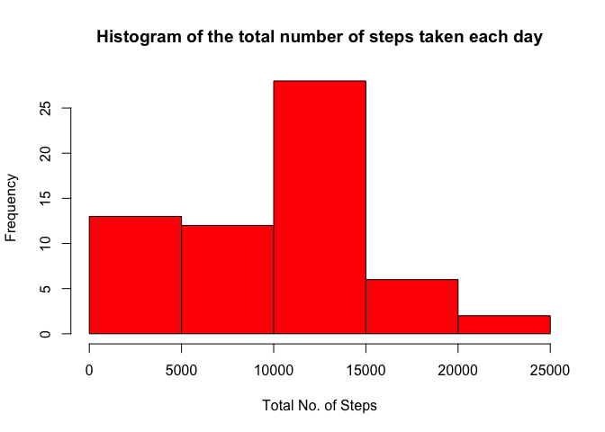
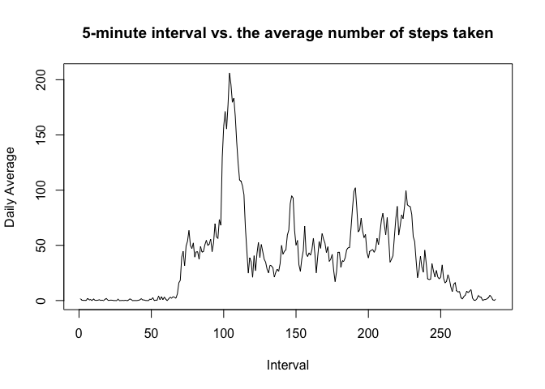
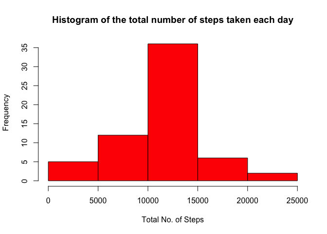
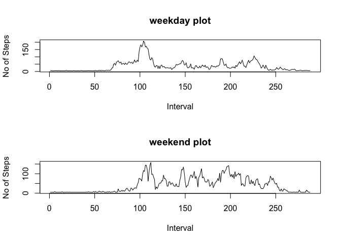

# Reproducible Research: Peer Assessment 1

knitr::opts_chunk$set(echo=TRUE)

## Loading and preprocessing the data


```r
data = read.csv("activity.csv")
str(data)
```

```
## 'data.frame':	17568 obs. of  3 variables:
##  $ steps   : int  NA NA NA NA NA NA NA NA NA NA ...
##  $ date    : Factor w/ 61 levels "2012-10-01","2012-10-02",..: 1 1 1 1 1 1 1 1 1 1 ...
##  $ interval: int  0 5 10 15 20 25 30 35 40 45 ...
```

```r
summary(data)
```

```
##      steps                date          interval     
##  Min.   :  0.00   2012-10-01:  288   Min.   :   0.0  
##  1st Qu.:  0.00   2012-10-02:  288   1st Qu.: 588.8  
##  Median :  0.00   2012-10-03:  288   Median :1177.5  
##  Mean   : 37.38   2012-10-04:  288   Mean   :1177.5  
##  3rd Qu.: 12.00   2012-10-05:  288   3rd Qu.:1766.2  
##  Max.   :806.00   2012-10-06:  288   Max.   :2355.0  
##  NA's   :2304     (Other)   :15840
```


## What is mean total number of steps taken per day?

```r
sum <- tapply(data$steps, data$date, sum, na.rm=TRUE)
```
Total number of steps per day by day are 0, 126, 11352, 12116, 13294, 15420, 11015, 0, 12811, 9900, 10304, 17382, 12426, 15098, 10139, 15084, 13452, 10056, 11829, 10395, 8821, 13460, 8918, 8355, 2492, 6778, 10119, 11458, 5018, 9819, 15414, 0, 10600, 10571, 0, 10439, 8334, 12883, 3219, 0, 0, 12608, 10765, 7336, 0, 41, 5441, 14339, 15110, 8841, 4472, 12787, 20427, 21194, 14478, 11834, 11162, 13646, 10183, 7047, 0


```r
hist(sum, main = "Histogram of the total number of steps taken each day", xlab = "Total No. of Steps", ylab = "Frequency", col = "red")
```

 


```r
steps_mean = mean(sum)
steps_median = median(sum)
```
Mean number of the total number of steps taken per day is 9354.2295082.
Median number of the total number of steps taken per day is 10395. 

## What is the average daily activity pattern?

```r
daily_avg = tapply(data$steps, data$interval, mean, na.rm=TRUE)
interval_vector = as.vector(seq(1:288))
plot(interval_vector, daily_avg, type="l", xlab="Interval", ylab="Daily Average", main="5-minute interval vs. the average number of steps taken")
```

 


```r
max_interval =  which.max(daily_avg)
```
Daily interval containing the maximum number of steps is 104

## Imputing missing values

```r
missing = sum(is.na(data$steps))
```
The total number of missing values in the data set are 2304


```r
newdata = data # make a copy of the data
newdata$steps[is.na(newdata$steps)] = mean(daily_avg)
newdaily_avg = tapply(newdata$steps, newdata$interval, mean)
summary(newdata)
```

```
##      steps                date          interval     
##  Min.   :  0.00   2012-10-01:  288   Min.   :   0.0  
##  1st Qu.:  0.00   2012-10-02:  288   1st Qu.: 588.8  
##  Median :  0.00   2012-10-03:  288   Median :1177.5  
##  Mean   : 37.38   2012-10-04:  288   Mean   :1177.5  
##  3rd Qu.: 37.38   2012-10-05:  288   3rd Qu.:1766.2  
##  Max.   :806.00   2012-10-06:  288   Max.   :2355.0  
##                   (Other)   :15840
```


```r
newsum <- tapply(newdata$steps, newdata$date, sum, na.rm=TRUE)
```
Total number of steps per day by day are 1.0766189\times 10^{4}, 126, 1.1352\times 10^{4}, 1.2116\times 10^{4}, 1.3294\times 10^{4}, 1.542\times 10^{4}, 1.1015\times 10^{4}, 1.0766189\times 10^{4}, 1.2811\times 10^{4}, 9900, 1.0304\times 10^{4}, 1.7382\times 10^{4}, 1.2426\times 10^{4}, 1.5098\times 10^{4}, 1.0139\times 10^{4}, 1.5084\times 10^{4}, 1.3452\times 10^{4}, 1.0056\times 10^{4}, 1.1829\times 10^{4}, 1.0395\times 10^{4}, 8821, 1.346\times 10^{4}, 8918, 8355, 2492, 6778, 1.0119\times 10^{4}, 1.1458\times 10^{4}, 5018, 9819, 1.5414\times 10^{4}, 1.0766189\times 10^{4}, 1.06\times 10^{4}, 1.0571\times 10^{4}, 1.0766189\times 10^{4}, 1.0439\times 10^{4}, 8334, 1.2883\times 10^{4}, 3219, 1.0766189\times 10^{4}, 1.0766189\times 10^{4}, 1.2608\times 10^{4}, 1.0765\times 10^{4}, 7336, 1.0766189\times 10^{4}, 41, 5441, 1.4339\times 10^{4}, 1.511\times 10^{4}, 8841, 4472, 1.2787\times 10^{4}, 2.0427\times 10^{4}, 2.1194\times 10^{4}, 1.4478\times 10^{4}, 1.1834\times 10^{4}, 1.1162\times 10^{4}, 1.3646\times 10^{4}, 1.0183\times 10^{4}, 7047, 1.0766189\times 10^{4}


```r
hist(newsum, main = "Histogram of the total number of steps taken each day", xlab = "Total No. of Steps", ylab = "Frequency", col = "red")
```

 


```r
newsteps_mean = mean(newsum)
newsteps_median = median(newsum)
```
Mean number of the total number of steps taken per day is 1.0766189\times 10^{4}.
Median number of the total number of steps taken per day is 1.0766189\times 10^{4}. 

Difference between New mean and old mean is -1411.959171.
Difference between New median and old median is -371.1886792.
Yes, this is a difference, but it depends on how the NAs are imputed. Imputing with medians produced a more normal distribution.

## Are there differences in activity patterns between weekdays and weekends?

```r
newdata1 = newdata
newdata1$date = as.Date(newdata1$date)
weekdays <- c('Monday', 'Tuesday', 'Wednesday', 'Thursday', 'Friday')
newdata1$whichday = factor((weekdays(newdata1$date) %in% weekdays), level=c(FALSE, TRUE), labels=c('weekend', 'weekday'))
str(newdata1)
```

```
## 'data.frame':	17568 obs. of  4 variables:
##  $ steps   : num  37.4 37.4 37.4 37.4 37.4 ...
##  $ date    : Date, format: "2012-10-01" "2012-10-01" ...
##  $ interval: int  0 5 10 15 20 25 30 35 40 45 ...
##  $ whichday: Factor w/ 2 levels "weekend","weekday": 2 2 2 2 2 2 2 2 2 2 ...
```


```r
weekday_data = subset(newdata1, whichday=="weekday")
weekend_data = subset(newdata1, whichday=="weekend")
weekday_avg = tapply(weekday_data$steps, weekday_data$interval, mean)
weekend_avg = tapply(weekend_data$steps, weekend_data$interval, mean)
par(mfrow=c(2,1))
plot(interval_vector, weekday_avg, type="l", main="weekday plot", xlab = "Interval", ylab="No of Steps")
plot(interval_vector, weekend_avg, type="l", main="weekend plot", xlab = "Interval", ylab="No of Steps")
```

 

```r
#plot(newdata1$steps[newdata1$whichday=="weekend"])
```
